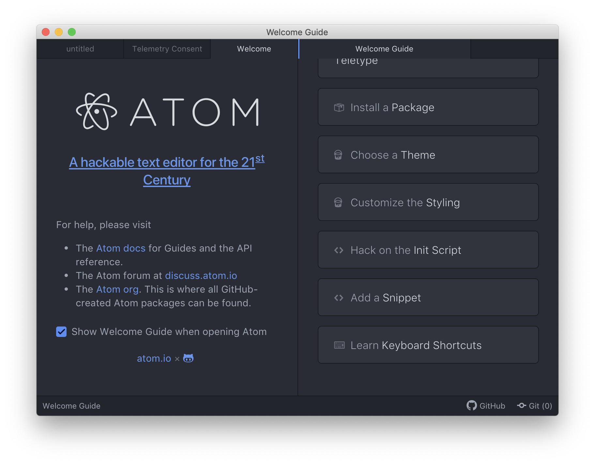
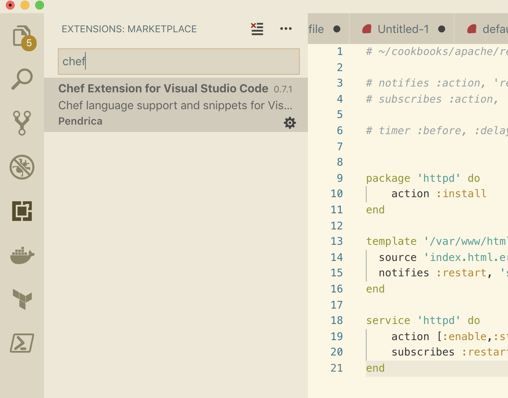
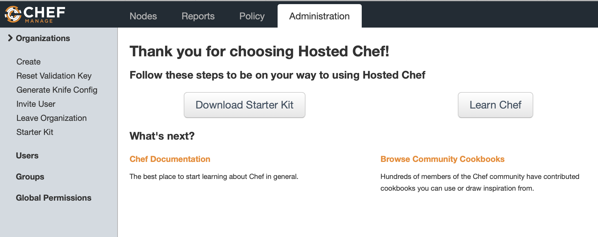
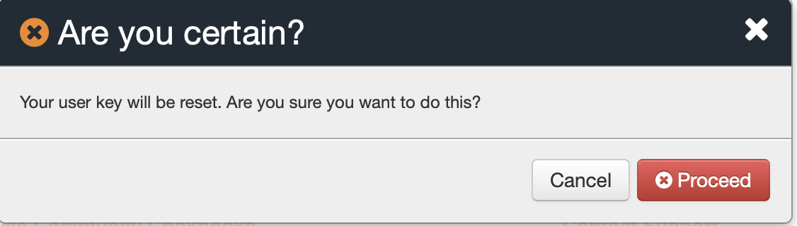

# Chef Server Setup

In this lab you are going to download `ChefDK` for your local workstation and then sign up for a Host Chef Server.  After signing up for a Chef Server account you are going to download the starter kit and use the `knife` config to connect to the Chef Server. 

## Setup Workstation 

### ChefDK installation

First step is to download and install `ChefDK` on your local workstation. 

Chef provides a simple installation binary for each operating system. 

Visit the [download page](https://downloads.chef.io/chefdk/), download the binary and run through the installation. 

Once the installation is complete you can open a terminal shell and run some commands to verify. 
```bash
chef --version 
chef-client --version 
knife --version 
ohai --version 
berks --version 
kitchen --version 
foodcritic --version 
cookstyle --version 
```

All of these should come back successfully and you will know that `ChefDK` was installed successfully.

### Git installation 
Now you need to download `git` for version control. 

You have a couple options, you can either install directly from [Git's Download page](https://git-scm.com/downloads) or if you have `brew` installed you can run a simple 
```bash
brew install git 
```

Config git was installed successfully. 
```
git --version 
```

### Text editor
Now that you've got `ChefDK` and `git` installed it's time to install a text editor with syntax highlighting, error checking, snippets and plugins to make it easier to work with Chef and other programming languages. 

As discussed in the slides there's a few different options. 

Atom: A great text editor built by GitHub.  Atom is completely open source and community driven.  It has a strong community and a simple to use interface. 

To install Atom go to their [download page](https://atom.io) and download the package for your operating system.  Run through the installation and you are ready to go. 

When you open Atom for the first time you'll see a screen like this: 



Go ahead and open the `cookbooks` directory. 

Visual Studio Code:  Lightweight editor with many plugins and a polished interface. 

To install VS Code download from [their site](https://visualstudio.microsoft.com/downloads/) and run through the installation.  Once that's complete open the app and search for the `Chef` extension. 




Great now you've got a text editor installed. 

## Hosted Chef Server 
Now sign up for a hosted Chef account. 

Visit the [sign up](https://api.chef.io/login) page and create a new account.  After creating the account confirm your email address and then login. 

You should see a page similar to this



Click on 'Download Starter Kit' and then when warned it will reset the user key click "Proceed" 



At this point a zip file named `chef-repo.zip` will be downloaded.  Unzip it and then enter the directory. 

Copy the cookbooks we've been working with into the `cookbooks` directory inside of `chef-repo`

```bash 
cp -r lab07/files/cookbooks/* ~/chef-repo/cookbooks/.
```

## Lab Complete